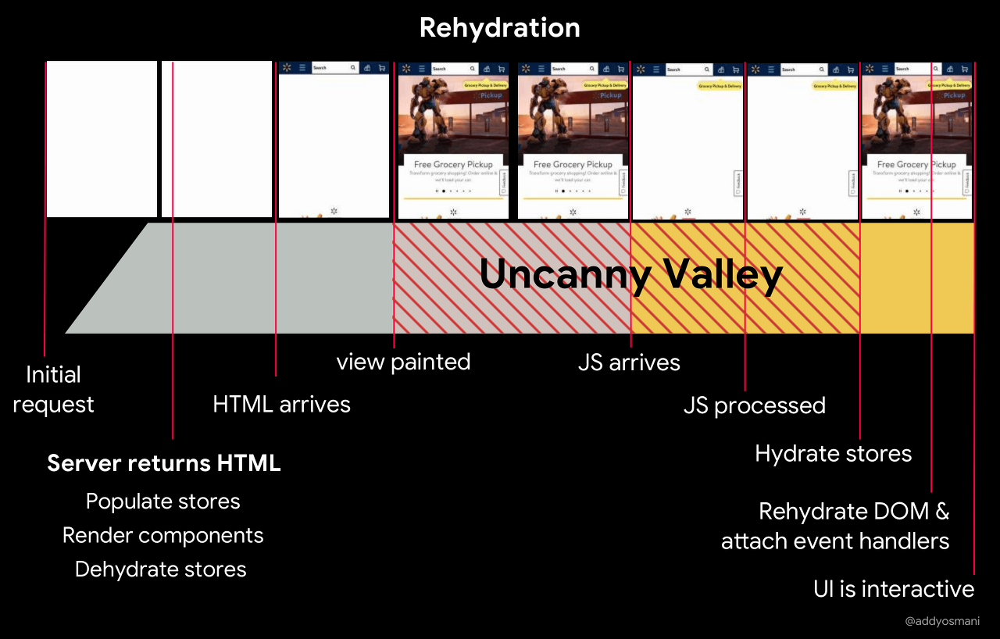

# Server-Side Rendering

서버 사이드 렌더링이란, 서버에서 HTML 페이지를 먼저 그려서 클라이언트로 보내, 화면을 표시하는 기술입니다.

기존의 CSR(Client-Side Rendering)은 빈 HTML 템플렛에 JS 번들을 통해 페이지를 채워넣는 방식입니다.

즉, CSR에선 클라이언트에서 HTML, CSS, JS 번들을 받아 실행시켜 페이지를 그리기 시작하는 것이죠.

### 렌더링 순서

| 해당 그림들은 Slash22에서 참고했습니다!

**SSR**

1. 유저의 요청
2. 프론트엔드 서버에서 API 요청
3. 응답을 받아 HTML을 미리 그림
4. 미리 그린 HTML과 함께 CSS, JS 번들이 고객에게 전달됨
5. JS 로직과 이벤트가 입혀지지 않은 HTML에 hydration을 통해 해당 HTML tag들에 이벤트 주입
6. 완성

**CSR**

1. 유저의 요청
2. HTML, CSS, JS 번들을 고객에게 전달
3. HTML과 CSS를 브라우저에 rendering하고 JS를 실행
4. JS 로직에 따라 HTML을 채워넣음
5. 그 과정에서 API call을 함
6. response가 오는대로 re-rendering
7. 완성

# Hydration

Hydration이라는 말은 영어로 '수화'라는 말로 촉촉하게 만든다는 뜻입니다!

뭘 촉촉하게 한다는 것일까요??

## SSR과 Static HTML

SSR에선 Server에서 React 코드를 통해 HTML을 만들게 됩니다.

하지만, CSR의 HTML에선 다르게 SSR에서 만들어서 브라우저에 전달해준 HTML은 event가 없는 static markup입니다.

### ReactDOMServer

ReactDOMServer이 잘 알려진 ReactDOM과 다른 점은 ReactDOMServer를 통해서 **static markup을 만들어 낸다**는 점입니다.

(참고로 ReactDOM은 Event가 적용된 markup들을 그려냅니다.)

Static한 markup은 Event가 적용되어 있지 않기 때문에, 그 어떤 interactive도 할 수 없습니다.

따라서 'Dry'하다고 표현하고 여기에 interactive가능하도록 static markup들에 event들을 적용해서 interaction 할 수 있도록 하는 행위를 'Hydration'이라고 표현합니다.

## ReactDOM.hydrate

Hydration은 .render가 아닌 .hydrate라는 메소드를 사용합니다.

이 메소드는 렌더링을 통해 새로운 웹페이지를 구성하는 것이 아니라 기존 DOM Tree에서 해당되는 DOM 요소를 찾아 정해진 자바스크립트 속성들만 적용시키는 역할입니다.

### 어떻게 적용하는데요?? 어떻게 동작하길래요??

여기서 의문이 들 수 있습니다. 이미 존재하는 DOM을 찾아서 Event만 적용해준다고 하는데 그 DOM을 어떻게 특정하는 걸까요??

과정을 이렇습니다.

1. 서버에서 받아온 DOM Tree와 클라이언트에서 자체적으로 렌더링한 Tree를 비교합니다.
2. 두 Tree 사이의 diff를 얻어낸 뒤, 클라이언트에서 렌더링한 tree에 맞춰 patch를 적용합니다.

여기서 diff는 key가 없는 reconciliation과 동일하게 비교합니다.

**element type과 순서만 비교합니다.**

따라서, server의 결과물과 client의 결과물이 다르면 결과물이 예상과 다를 수 있습니다.

suppressHydrationWarning={true}를 사용하면 해결되지만, 오류 표시만 제거하는 것이기 때문에 최대한 사용을 자제해야합니다.

### ref

https://blog.somewhatabstract.com/2020/03/16/hydration-and-server-side-rendering/

https://blog.saeloun.com/2021/12/16/hydration.html

https://fourwingsy.medium.com/next-js-hydration-%EC%8A%A4%ED%83%80%EC%9D%BC-%EC%9D%B4%EC%8A%88-%ED%94%BC%ED%95%B4%EA%B0%80%EA%B8%B0-988ce0d939e7
