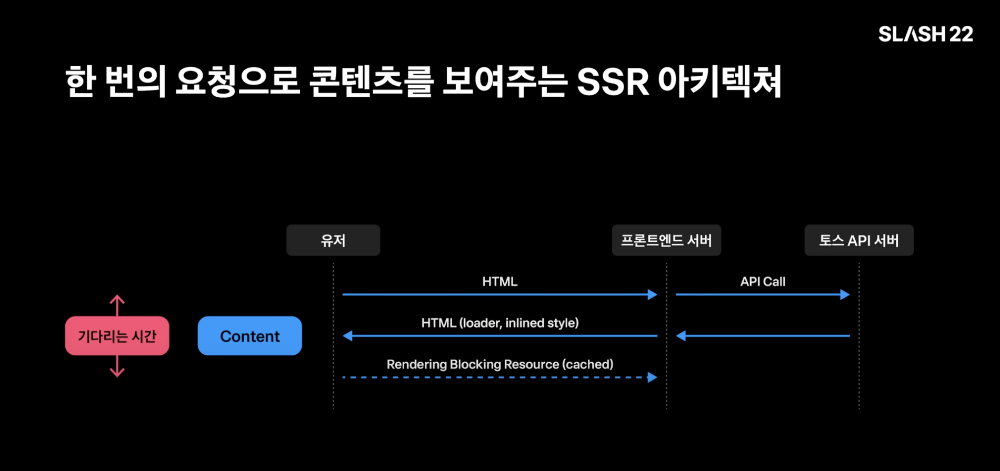
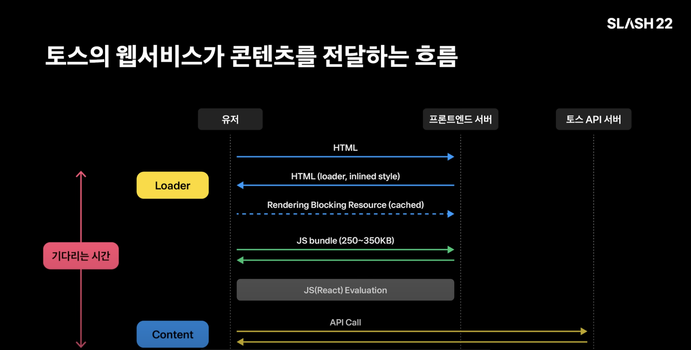

# Server-Side Rendering

서버 사이드 렌더링이란, 서버에서 HTML 페이지를 먼저 그려서 클라이언트로 보내, 화면을 표시하는 기술입니다.

기존의 CSR(Client-Side Rendering)은 빈 HTML 템플렛에 JS 번들을 통해 페이지를 채워넣는 방식입니다.

즉, CSR에선 클라이언트에서 HTML, CSS, JS 번들을 받아 실행시켜 페이지를 그리기 시작하는 것이죠.

### 렌더링 순서

| 해당 그림들은 Slash22에서 참고했습니다!

**SSR**

1. 유저의 요청
2. 프론트엔드 서버에서 API 요청
3. 응답을 받아 HTML을 미리 그림
4. 미리 그린 HTML과 함께 CSS, JS 번들이 고객에게 전달됨
5. JS 로직과 이벤트가 입혀지지 않은 HTML에 hydration을 통해 해당 HTML tag들에 이벤트 주입
6. 완성

**CSR**

1. 유저의 요청
2. HTML, CSS, JS 번들을 고객에게 전달
3. HTML과 CSS를 브라우저에 rendering하고 JS를 실행
4. JS 로직에 따라 HTML을 채워넣음
5. 그 과정에서 API call을 함
6. response가 오는대로 re-rendering
7. 완성

