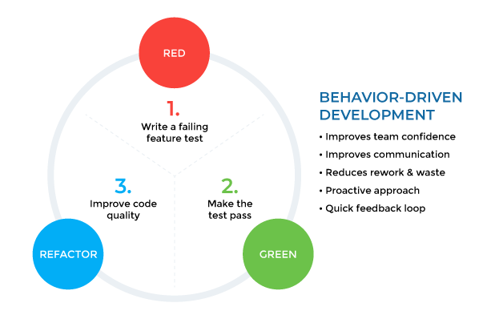

# Why we should Test?

> IEEE에 정의된 "테스트" : 시스템이 정해진 요구를 만족하는지, 예상과 실제 결과가 어떤 차이를 보이는지 수동 또는 자동 방법을 동원하여 검사하고 평가하는 일련의 과정

테스트는 중요합니다.

복잡한 Application 안에선 수많은 side-effect들이 얽혀있기 떄문에, 내가 짠 로직이 의도대로 돌아가는지 알 수 없기 때문이죠.

하나의 간단한 feature만해도 그렇습니다.

따라서, 테스트를 아주아주 모든 케이스를 꼼꼼하게 하면 좋지만,,, 자원은 한정되어 있고 시간은 없습니다.

그러니 우리들은 테스트를 효율적으로 설계할 필요가 있습니다!

## 어떻게하면 테스트를 효율적으로 설계할 수 있을까?

방법은 2가지 입니다.

1. 각자의 경험을 기반으로 만들기
2. 테스트 설계 기법에 기반한 방식

각자의 경험은 소중하고 확실하지만, 모든 사람이 같은 경험을 할 수 없으니, 대규모의 멋진 프로젝트를 만들기에는 역부족입니다.

개발에 프레임워크를 적용하는 이유와 같죠!

따라서, 우리는 효율적으로 설계된 테스트 설계 기법들을 공부하고 적용할 필요가 있습니다.

## 몇가지 테스트 설계 기법

대표적으로 3가지 방법이 있습니다.

이 방법들은 모두 Agile 개발 방법과 함께 나온 방법들입니다.

- TDD (Test Driven Development)
- BDD (Behavioral Driven Development)
- DDD (Domain Driven Development)

### ref

[LINE에서 테스트를 최적화하는 방법](https://engineering.linecorp.com/ko/blog/testing-optimization)

# TDD

Test-Driven Development(TDD)로 테스트 주도 개발이라는 뜻입니다.

애자일(Agile) 개발 방법 중 하나로 매우 짧은 개발 서클의 반복에 의존하는 소프트웨어 개발 프로세스입니다.

1. 먼저 요구사항을 검증하는 테스트 케이스를 작성
2. 그 테스트 케이스를 통과하기 위한 최소한의 코드를 생성
3. 마지막으로 작성한 코드를 표준에 맞게 리팩토링.

## TDD의 장점

테스트하기 좋은 코드를 항상 신경써서 짜야하기 때문에, 비대한 함수와 객체를 쪼개고 함수를 순수하게 만들기 위해 노력하여 좋은 코드를 작성할 수 있도록 유도합니다! (그야말로 굉장한 장점...!)

또한, 기존의 함수들을 리팩토링하려고 할 때, 해당 함수에 대한 요구사항이 테스트코드로 확실하게 보장되기 때문에, 개발자는 편하게 리팩토링이 가능해서 리팩토링 속도도 빨리지고 코드의 퀄리티도 그만큼 향상하게 됩니다...!

또한 테스트 코드는 일종의 함수의 문서 역할을 해주기도 하기 때문에, 프로젝트 유지보수에도 아주 긍정적인 영향을 줍니다!

하지만,,,, **이 좋은 것을 왜 안할까요?**

## TDD의 단점

기존 코드 작성 + 테스트 코드이기 때문에 당연히 시간이 많이 듭니다.

테스트코드를 잘 짜기 위해서 숙련이 필요합니다...! TDD는 개발 방법론이기 때문에, 혼자만 잘하기 보단, 팀 다 같이 잘해야합니다.

이 숙련 과정에서 테스트코드 작성의 시간이 코드 작성보다 시간이 더 많이 걸릴 수 있기 때문에, 배보다 배꼽이 큰 상황이 발생할 수 있습니다,,,,

# BDD (Behavior Driven Development)

TDD에서 파생된 프로그래밍 개발 방법으로, TDD에서 한발 더 나가 테스트 케이스 자체가 요구사항이 되도록 하는 개발 방법입니다.

즉, "어떤 것을 해야만하는지"라는 문장으로 작성하여 시나리오 기반의 행위에 대한 테스트에 집중할 수 있도록 합니다.

## BDD의 장점

테스트 케이스를 모든 사람들이 이해할 수 있는 문장으로 작성하기 때문에, 비 개발자와의 커뮤니케이션도 TDD에 비해 원활합니다.

비즈니스 요구사항을 그대로 테스트 케이스로 녹여내 테스트 코드를 만들기 때문에, 비즈니스 요구에 정확히 부합하는 코드를 작성할 수 있습니다.

## TDD와의 차이점

TDD는 아주 작은 함수들부터 테스트하지만, BDD는 작은 함수 단위의 유닛 테스트를 권장하지 않습니다.

따라서, 목적도 달라지게 되는데 TDD는 개발 코드의 완성이 목적이고 BDD는 개발 결과의 검증이 목적입니다.

## 테스트 방법

하나의 시나리오를 Given, When, Then 구조를 가지는 것을 기본으로 합니다.

- Feature : 테스트에 대상의 기능/책임을 명시합니다.
- Scenario : 테스트 목적에 대한 상황을 설명합니다.
- Given : 시나리오 진행에 필요한 값을 설정합니다.
- When : 시나리오를 진행하는데 필요한 조건을 명시합니다.
- Then : 시나리오를 완료했을 때, 보장해야 하는 결과를 명시합니다.

# DDD (Domain Driven Development)

> 도메인은 사용자가 인식하고 사용하는 모든것을 가리킵니다.

도메인 주도 개발이라는 말 그대로 도메인 로직에 초점을 두고 개발을 합니다.

도메인 그 자체를 개발하기 때문에, 도메인 전문가와 개발자간의 커뮤니케이션 비용을 줄일 수 있는 장점이 있습니다.

또한, 도메인으로 개발 영역을 한정지어 개발하기 때문에, 의존성을 확실하게 제어할 수 있어 유지보수에 유리하다는 장점이 있습니다.

### ref

[JBee의 TDD, BDD, DDD](https://asfirstalways.tistory.com/296)

[Metafor, 애자일 방법과 TDD, BDD](https://blog.metafor.kr/159)

[적당히 깔끔하게 정리된 포스트](https://naon.me/posts/til54)

[테스트 주도 개발 in 나무위키](https://namu.wiki/w/%ED%85%8C%EC%8A%A4%ED%8A%B8%20%EC%A3%BC%EB%8F%84%20%EA%B0%9C%EB%B0%9C)
