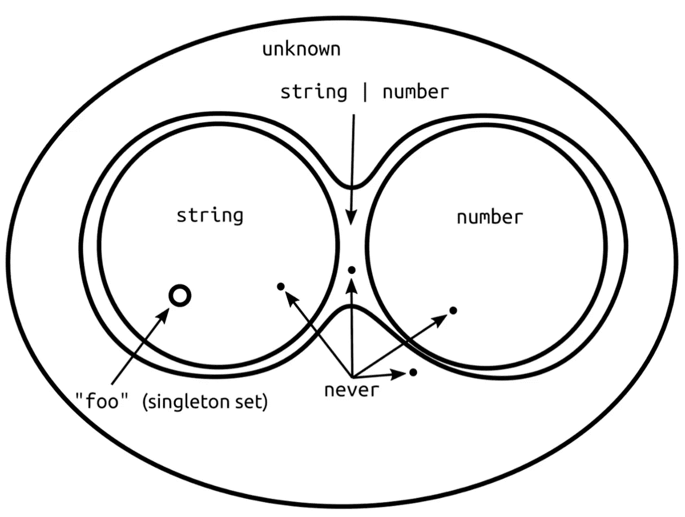

# Summary

TypeScript에 대한 공간입니다!

# 타입스크립트와 자바스크립트와의 관계
TypeScript와 JavaScript의 관계를 한마디로 정의한다면, TypeScript는 JavaScript의 ‘Superset’ 즉, 상위 집합이라고 할 수 있습니다.

기호로 표현한다면 ```JavaScript ⊂ TypeScript``` 로 표현할 수 있겠습니다!

이 것을 글로 풀어 설명한다면

- 문법의 측면에선, JavaScript의 문법은 TypeScript에서도 그대로 사용할 수 있습니다.
- 코드의 측면에선, 거꾸로 TypeScript로 작성된 코드가 문제가 없다면 JavaScript에서도 전혀 문제가 없습니다는 의미가 됩니다!

이제 TypeScript의 몇가지 특징을 알아보겠습니다.

## 타입스크립트는 자바스크립트의 런타임 동작을 따른다.

TypeScript는 다른 것이 아닌 JavaScript의 런타임 동작을 따라갑니다.

따라서 자바스크립트의 말도 안되는 런타임 동작을 그냥 받아주기도 합니다.

예를 들면, 아래와 같은 코드...

```
const aa = 1 + '1'; // 11 🤪

const bb = null + 2; // error!
```

aa 변수에서 계산 되는 상식밖의 계산식은 에러가 되어야 할 것 같은데 Type Error를 내지 않습니다,,,

이런 부분은 TypeScript가 완벽한 Type Checking을 목적으로 만들어져 있지 않다는 것을 간접적으로 보여줍니다.

그리고, **이런 당황스러운 부분은 TypeScript의 특성을 이해하고 알아만 두되 좋은 코드를 위해서 이런 상식 밖의 코드는 아예 사용하지 않는 것이 좋다는 것이 제 의견입니다!**

## 타입스크립트가 생겨난 목적

그렇다면 TypeScript를 만들어 낸 목적은 무엇일까요?

`런타임에 오류를 발생시킬 코드를 미리 찾아내는 것?`

TypeScript는 정적 타입 언어라는 점을 고려해보면 맞는 말인 것 같습니다!

그렇다면 정적 타입 언어는 무엇이고 굳이 정적 타입 언어를 사용하는 이유가 있을까요?

## 정적 타입 언어

> Good programmers worry about data structures and their relationships. - Linus Torvalds

정적 타입 언어에는 TypeScript이외에도 C, C++, C#, Rust, Java, Swift, Kotlin 등등이 있습니다.

프로그래밍 언어 중에선 동적 타입 언어보다 정적 타입 언어가 더 많습니다.

```typescript
// TypeScript
const aa: number = 12; // aa 변수에 number라는 type을 정해주었습니다!
```

### 정의

정적 타입 언어란 <u>컴파일 시에 변수의 타입이 결정되는 언어</u>를 의미합니다. 컴파일 시에 타입이 맞지 않으면 에러가 발생하게 됩니다!

따라서 프로그래머가 변수에 들어갈 데이터의 타입을 명시해줘야 합니다.

### 장점

- 타입 체크를 통한 잠재된 런타임 에러를 사전에 발견할 수 있어 **프로그램의 안정성을 높일** 수 있습니다. (간단한 typo 들 또한 잡아줍니다!)
- 컴파일 시에 미리 타입을 결정하기 때문에 **실행속도가 빠릅니다.**
- 자료형을 미리 알고 있기 때문에, 개발시에 Code Editor의 **자동완성을 활용**할 수 있습니다. 이는 생산성 향상과도 연결되지요!
- 수많은 변수들의 타입이 적혀있기 때문에 **가독성이 좋습니다**. = 좋은 가독성은 협업과 유지보수에도 유리합니다!

### 단점

- 개발시에 매번, 타입을 결정해줘야해서 번거롭습니다. (코드의 길이가 길어지고 번거로워지면 관리가 까다로워지고 **개발 속도가 늦어지게 됩니다!**)
- 동적 타입 언어과 비교하면 타입이라는 새로운 개념을 배워야하기 때문에 **learning-curve가 높습니다.**

## 동적 타입 언어

대표적으로 JavaScript가 동적 타입 언어입니다. 그 외에 Ruby, Object-C, Python, PHP가 동적 타입 언어에 속합니다.

```javascript
// JavaScript
const aa = 12; // aa 변수에 12라는 숫자만 할당하고 타입을 정해주지 않았습니다!
							 // 하지만 런타임에 aa 변수는 number라는 타입으로 정해지게 됩니다.
```

### 정의

동적 타입 언어는 <u>자료형이 런타임에 결정</u>됩니다.

즉, 프로그래머가 자료형을 결정해주지 않아도 프로그램이 실행되었을 때, 할당된 변수의 자료형에 따라 알아서 변수의 자료형이 결정이 됩니다.

### 장점

- 타입 제한이 없기 때문에, 코드 작성이 유연하고 수월해집니다.
- 타입을 신경쓰지 않아도 되기 때문에 **개발 속도도 크게 증가**합니다.
- 타입을 고려하지 않아도 되기 때문에 learning-curve가 짧습니다. (많은 비전공자 분들이 프로그램 입문을 JavaScript와 Python으로 하시죠!)

### 단점

- 개발시에, 타입을 고려하지 않았다고 하여도 런타임에서 정해진 자료형에 적합한 태스크가 실행되지 않을 시에는 런타임 에러를 일으킬 수 있습니다.
- 위와 같은 런타임 에러를 피하기 위해 결국 타입을 기억해야 하는데, 이는 오히려 **개발의 복잡성을 증가**시킵니다.
- 타입을 기억해야한다는 것은 코드의 가독성이 떨어진 다는 것과 같고, **협업과 유지보수에도 악영향을 줍니다.**

### 런타임이란?

[https://asfirstalways.tistory.com/99](https://asfirstalways.tistory.com/99)

런타임(Runtime)과 컴파일타임(Compiletime)은 소프트웨어 프로그램개발의 서로 다른 두 계층의 차이를 설명하기 위한 용어이다.

**컴파일타임**
프로그램을 생성하기 위해 개발자는 첫째로 소스코드를 작성하고 컴파일이라는 과정을 통해 기계어코드로 변환 되어 실행 가능한 프로그램이 되며, 이러한 편집 과정을 컴파일타임(Compiletime) 이라고 부른다.

**런타임**
컴파일과정을 마친 프로그램은 사용자에 의해 실행되어 지며, 이러한 응용프로그램이 동작되어지는 때를 런타임(Runtime)이라고 부른다.

"런타임"과 "컴파일 타임"이라는 용어는 종종 서로 다른 두 가지 타입의 에러를 나타내기 위해
사용되어지곤 하는데,

**컴파일 타임 에러**는 프로그램이 성공적으로 컴파일링되는 것을 방해하는 신택스에러(Syntax error)나 파일참조 오류와 같은 문제를 말하며, 이런 경우 컴파일러는 컴파일 타임 에러를 발생시키고 일반적으로 문제를 일으킨 소스코드 라인을 지시해준다.
만약, 어떤 소스코드가 이미 실행가능한 프로그램으로 컴파일 되었다 할지라도 이것은 여전히 프로그램의 실행중에 버그를 일으킬 수 있다. 예를 들자면, 예상치 못한 오류 또는 충돌로 동작하지 않을 수 있는데 이렇게 프로그램이 실행중에 발생하는 형태의 오류를 **런타임오류** 라고 한다.

## 여러 정적 언어와는 다른 TypeScript만의 특징

- 타입 오류가 있는 코드도 컴파일이 가능합니다.

    TypeScript의 타입 체크와 컴파일은 독립적으로 작동하기 때문에 설령 타입 에러가 있다 하더라도 JavaScript로 컴파일 됩니다. (컴파일은 진행되고 단순히 에러가 있는 곳을 알려주기만 할 뿐입니다.)

    다른 정적언어에서는 절대로 불가능한 일이지만 TypeScript이기에 가능합니다. ㅎㅎ

    아마, 타입 에러가 있더라도 그 코드가 JavaScript로 바뀌어도 잘 작동하기 때문이 아닐까요...? 라는 예상을 해봅니다.

    이런 현상을 막으려면 noEmitOnError 옵션을 true로 설정해주면 됩니다!

- TypeScript의 모든 구문은 런타임에 영향을 주지 않는다. 성능, 타입 연산, 타입 체킹, 심지어 정해놓은 타입이 아닐 수도 있다.

    아시다시피 TypeScript로 적은 코드는 JavaScript로 컴파일하면 TypeScript 내용이 전혀 남지 않게 됩니다!

    따라서 TypeScript의 Type 시스템을 이용하여 정적 타입을 맞추어 코드를 작성하였다 하더라도 JavaScript로 컴파일하여 실행하면, 런타임엔 컴파일 된 JavaScript만 있을 뿐, TypeScript 기능을 전혀 사용할 수 없습니다.

    만약 아래와 같이 Type으로 if문을 사용 할 경우를 가정하면,

    ```typescript
    interface Square {
    	width: number
    }

    interface Rectangle extends Square {
    	height: number
    }

    const aa: Rectangle = {
    	width: 12,
    	height: 12,
    };

    function getWidth(square: Square) {
      // Rectangle is type... so it's deleted when code is compiled
    	if (square instanceof Rectangle) {
    		// some code
    	}
    }
    ```

    Rectangle로 Type을 구분했지만, Rectangle은 Type이므로 컴파일시에 사라져버립니다.

    따라서, 같은 로직을 사용하려면 **런타임에서도 유효한 코드**를 만들어야 하는데, 방법은 2가지가 있습니다.

    - 태그된 유니온(Tagged Union)
    - 클래스 (Class) 사용

    **태그된 유니온(Tagged Union)**

    ```typescript
    interface Square {
    	kind: 'square'
    	width: number
    }

    interface Rectangle extends Sqaure {
    	kind: 'rectangle'
    	height: number
    }

    const aa: Rectangle = {
    	kind: 'rectangle',
    	width: 12,
    	height: 12,
    };

    function getWidth(square: Square) {
      // kind is 'tag'
    	if (square.kind === 'rectangle') {
    		// some code
    	}
    }
    ```

    kind라는 새로운 property를 주어 타입을 구분합니다.

    이 방법은 런타임에서도 kind라는 property가 살아있기 때문에 안전합니다.

    **클래스 (Class)**

    class를 사용하면 class 그 자체가 interface type이 됩니다.

    하지만 class는 런타임에서 실존하는 Object이기 때문에 instanceof Rectangle 을 그대로 사용해도 문제없습니다.

    ```typescript
    class Square {
    	constructor(width: number) {
    		this.width = width;
    	}
    }

    class Rectangle extends Square {
    	constructor(width: number, height: number) {
    		this.width = width;
    		this.height = height;
    	}
    }

    const aa: Rectangle = new Rectangle(12, 12);

    function getWidth(square: Square) {
    	// ok in Runtime!
    	if (square instanceof Rectangle) {
    		// some code
    	}
    }
    ```

- TypeScript만의 함수 오버로드 기능의 특징

    TypeScript에서는 다른 정적 타입 언어들과는 다른 독특한 함수 오버로드 기능을 지원합니다.

    ```typescript
    function double(x: number): number
    function double(x: string): string
    function double(x: any) { return x + x; }

    // X, 구현을 2번하는 것은 불가능합니다!
    // function double(x: number): number { return x + x }
    ```

    보이듯이, TypeScript의 함수 오버로드는 Type 제한적입니다.

    위 코드를 컴파일하면 아래와같이 변하기 때문입니다.

    ```javascript
    function double(x) { return x + x }
    ```

    TypeScript의 함수 오버로드 기능은 오버로딩 타입 중에서 일치하는 것을 순차적으로 찾아 맞춰줍니다.

    가령 위의 코드는 아래처럼 작동합니다.

    ```typescript
    double(2); // 4 number
    double('1'); // 11 string
    ```

    하지만,,, **이펙티브 타입스크립트에선 함수 오버로드 기능이 아닌 조건부 타입 사용을 권장합니다.**

    이유는, <u>오버로드 기능은 각각 독립적인 타입만 받아들일 수 있습니다.</u>

    따라서 string | number와 같은 타입을 받아들이지 못합니다.

    이는 오버로드 기능의 의도와는 다르기 때문에 좋지 않습니다.

    이를 보완 할 수 있는 것이 아래의 조건부 타입입니다.

    ```typescript
    // 주의! : 여기서 T를 그대로 return할 경우 string, number가 아닌 literal 값이 됩니다.
    function double(x: T)<
      T extends string | number
    >: T extends string ? string : number
    function double(x: any){
     return x + x;
    }
    ```

    위의 코드 대로면 double의 paramter로 string, number, string | number 어떤 것이든 받아들일 수 있고, return type으로 string 혹은 number를 전해줄 수 있습니다.

    오버로드 기능의 의도와 정확히 맞는 구현입니다!


## 자바스크립트의 Duck Typing & 타입스크립트의 구조적 타이핑

TypeScript는 JavaScript의 구동 방식을 그대로 따르기 때문에 JavaScript가 어떻게 작동되는지 살펴볼 필요가 있습니다.

JavaScript는 `duck typing` 기반 입니다.

**duck typing?**

객체가 어떤 타입에 부합하는 변수나 메소드를 가질 경우 객체를 해당 타입에 속하는 것으로 간주하는 방식입니다.

The Duc Test에서 유래된 말로 다음과 같은 명제로 정의됩니다.

“만약 어떤 새가 오리처럼 걷고, 헤엄치고, 꽥꽥거리는 소리를 낸다면 나는 그 새를 오리라고 부를 것이다”

TypeScript는 duck typing을 구현하기 위해 `구조적 타이핑`이라는 개념을 사용합니다.

**구조적 타이핑?**

매개변수 값이 요구사항을 만족한다면, 타입이 무엇인지 신경 쓰지 않는 동작입니다.

```typescript
interface Vector2D {
	x: number
  y: number
}

function calcLength(v: Vector2D) {
	return Math.sqrt(v.x * v.x + v.y * v.y);
}

const aa = {
	name: 'something',
	x: 12,
  y: 12,
}

// aa는 정확히 Vector2D와 같진 않지만, x와 y 속성을 똑같이 가지고 있다.
// 열려있는 구조적 타이핑의 특징
calcLength(aa); // ok!!
```

이는 미지의 object를 받아들일 때, 유용하여, 테스트 시에 유용하게 사용할 수 있습니다.

어떤 거대한 객체가 있다고 했을 때, 그것을 그대로 mocking하여 type으로 만드는 것이 아닌 필요한 property만 type으로 정해주면 그대로 활용할 수 있습니다.

구조적 타이핑의 `‘열려’`있는 특징이 있다고 할 수 있습니다.

반대는 `‘봉인된 (Sealed)’`, `‘정확한 (Precise)’` 특성입니다.

이는 위 코드의 calcLength(x: Vector2D) 일 때, **x에는 반드시 Vector2D만 와야한다는 것**이 ‘봉인된 (Sealed)’, ‘정확한 (Precise)’ 특성이라고 할 수 있습니다.

구조적 타이핑의 ‘열린’ 특징을 보완하기 위해 `‘상표’`를 사용 할 수 있습니다.

**상표**

상표는 타입시스템으로 런타임에 상표를 검사하는 것과 동일한 효과이지만, 런타임 오버헤드를 없앨 수 있고 추가 속성을 붙일 수 없는 string이나 number 같은 내장 타입도 상표화 할 수 있습니다.

아래는 string 중에서도 절대경로인 것만 brand를 붙여 구별하는 방법입니다.

```typescript
type AbsolutePath = string & {_brand: 'abs'}
function listAbsolutePath(path: string) {
  // path as AbsolutePath도 가능하지만 단언문은 지양해야합니다!!!
  if (isAbsolutePath(path)) {
		// ... AbsolutePath인 type만 들어오게 됩니다.
  }
}
// 절대경로인 string만 걸러내 AbsolutePath타입으로 만듭니다.
function isAbsolutePath(path: string): path is AbsolutePath {
	return path.startsWith('/');
}
```

### any와 타입 단언을 쓰면 안되는 이유 (+ 꼭 any를 사용해야한다면)

any 타입을 사용하면 타입 체커와 타입스크립트 언어서비스를 무력화시켜 버립니다. any 타입은 진짜 문제점을 감추며, 개발 경험을 나쁘게하고, 타입 시스템의 신뢰도를 떨어뜨립니다. 최대한 사용을 피하도록 합시다!

만약 써야한다면

- **any의 범위를 최소화!**

    ```typescript
    function processBar(x: any) { ... }

    function f1() {
      // 이렇게 하면 x는 f1 scope안에서 영원히 any가 되어린다.
    	const x: any = expressionReturningFoo();
      processBar(x);
    }

    function f2() {
    	const x = expressionReturningFoo();
    	// parameter를 적용할 때에만 any가 된다.
      processBar(x as any);
    }

    // 이런식으로 any로 wjrdydehlsms scope를 최소화해야한다.
    ```

- **대신 @ts-ignore를 사용**
- **any를 최대한 구체적으로 변형해서 사용하기**
    - ex) Array라면 any[]를 사용해 Array의 method를 사용할 수 있도록 유도
    - ex) Object라면 { [key: string]: any }로 변형해서 사용 (Object와 인데 다른 점은 아래 참고)
- **any를 진화시키기**
    - any의 진화는 any 타입에 어떤 값을 할당할 때만 발생.
    - 물론 애초에 명시적 타입구문을 사용하는게 훨씬 더 좋은 설계!
- **모르는 값에는 any 대신 unknown을 사용하기**

    > unknown Type은 any 처럼 어떠한 값도 받아들일 수 있지만, 어떠한 타입으로도 할당이 안되기 때문에 사용할 수가 없어 해당 변수를 사용하기 위해선, **타입 변환을 강제**하기 때문에 any보다 훨씬 안전한 타입이라고 할 수 있습니다.
    >

    **any의 특징**

    1. **어떠한 타입이든** any 타입에 **할당 가능하다.**
    2. any 타입은 **어떠한 타입으로도 할당 가능하다.**

    **unknown 특징**

    TypeScript 3.0부터 등장, any의 type-safe한 버전이라고 생각하면 된다.

    1. 어떠한 타입이든 unknown 타입에 **할당 가능**합니다.
    2. **어떠한 타입으로도 할당이 불가능합니다.**
    3. unknown 타입으로 선언된 변수는 프로퍼티에 접근 할 수 없고, 메소드에도 접근이 불가능합니다. 따라서 인스턴스를 생성할 수도 없습니다. (그야말로 어떤 데이터인지 알 수 없기 때문)

    ```typescript
    let myVar: unknown = 'hello';

    // 이 변수의 타입은 unknown이므로 어떤 타입의 값이든 할당과 재할당이 가능
    myVar = 42;

    // **오류** myVar 변수의 타입이 명확하지 않으므로 number 타입 변수에 값 할당이 불가능
    let age: number = myVar;

    // unknown 타입 변수는 이렇게 사용할 때 타입을 명시해주어야 함
    // (그렇다고 타입 단언은 하지말자... 짧게 설명하기 위해 이렇게 했다.)
    // (엄격한 비교나 Type Guard를 통해 Type을 확정해 줄 수 있다.)
    let age: number = (myVar as number);
    ```

    **never 특징**

    1. 어떠한 타입도 never 타입에 **할당 불가능**합니다.
    2. 어떠한 타입으로도 할당 가능합니다.

    ```typescript
    // never 변수에는 어떤 값도 할당할 수 없습니다.
    // 그래서 아래의 두 코드는 TypeScript에서 컴파일 오류가 발생합니다.
    const first: never = 42;
    const second: never = 'some text';

    // 그렇다면 never는 언제 활용할 수 있는가?
    // 1. function이 절대로 return하지 않는 다는 것을 명시해 줄 수 있다.
    function fetchSomething(): never {
    	throw new Error('Error occured');
    }

    // 2. 특정 타입 값을 할당받지 못하게 하는 것도 가능
    // 아래 타입은 string 타입인 경우 never로 추론해 string을 할당받지 못하는 타입이다.
    type NonString<T> = T extends string ? never ; T;
    ```

    **void vs never**

    아무것도 반환하지 않는다는 점에서 같은데 뭐가 다른 것일까?

    void - 아무것도 반환하지 않지만, 함수가 종료됨

    never - 함수가 종료되지 않아 절대로 return 하지 않음을 명시 (return 이외에 무한루프 혹은 throw같은 것으로 끝났을 때, 함수의 return type은 never가 된다.)

**타입 관계 설명 다이어그램**



- **object vs Object vs {}**
  - object

    primitive Type을 제외한, 객체 및 배열을 할당 할 수 있습니다. (TypeScript 2.2)

  - Object

    JavaScript에선 모든 객체들은 Object를 상속하는데 그 Object의 타입이 바로 “Object”입니다.

  - {}

    null과 undefined를 제외한 모든 값을 포함합니다. undefined 등장 이전에는 이것을 사용했었습니다.

- **object와 { [key: string]: any }와 다른 점**

```typescript
function hasTwelveLetterKey(o: { [key: string]: any }) {
	for (const key in o) {
		console.log(key, o[key]);  // O
	}
}

function hasTwelveLetterKey(o: object) {
	for (const key in o) {
		console.log(key, o[key]);  // X Error!
                      // '{}' 형식에 인덱스 시그니처가 없으므로
                      // 요소에 암시적으로 'any' 형식이 있습니다.
	}
}
```

## 타입이 집합이라고 생각하기(다른 언어의 extends와 헷갈릴 수 있다.)

### 할당 시에

그 안의 작은 범위의 타입 = 범위가 넓은 타입 (X, 이 타입이 작은 타입과 일치하는지 확신할 수 없다.)

범위가 넓은 타입 = 그 안의 작은 범위의 타입 (O, 작은 범위로 타입이 갱신 됨)

### 타입스크립트 용어와 집합 이론 용어 사이의 대응

타입스크립트 용어 | 집합 용어
-----|-----
never | 공집합
리터럴 타입 | 원소가 1개인 집합
값이 T에 할당 가능 | ∈ (값이 T의 원소)
T1이 T2에 할당 가능 혹은 상속 | T1 ⊂ T2 (부분 집합)
T1 \| T2 | T1 ∪ T2 (합집합), OR
T1 & T2 | T1 ∩ T2 (교집합), AND
unknown | 전체(universal) 집합

### 헷갈리기 쉬운 객체끼리 유니온, 인터섹션

type 할당은 아주 간단하지만, 객체 끼리의 유니온과 인터섹션은 객체 안의 property에도 영향이 있기 때문에 헷갈릴 수 있다.

```typescript
type a = string;
type b = number;

// type의 union은 매우 직관적이다.
type union = a | b; // string | number
```

그렇다면 Object의 경우는 어떨까?

union의 경우 “합집합” 이기 때문에 객체끼리의 프로퍼티까지 함께 합쳐지는 것으로 생각 할 수 있다.

하지만 A | B는 A OR B라는 관점에서 본다면 좀 더 정확 할 것이다.

```typescript
type a = { propA: 'asdf' };
type b = { propB: 12 };

// 예상 결과
// { propA: 'asdf', propB: 12 }
type union = a | b;  // { propA: 'asdf' } | { propB: 12 }

// 하지만 { 'propA': string } OR { 'propB': number } 라는 관점에서 생각해보면
// propA를 가진 객체 혹은 propB를 가진 객체가 가능하다! 라고 해석할 수 있다.
```

반대인, intersection도 마찬가지이다. “교집합” 이기 때문에 never일 것이라고 생각 할 수 있다.

하지만 A & B는 A AND B라는 관점에서 본다면 더 정확하다.

```typescript
type a = { propA: 'asdf' };
type b = { propB: 12 };

// 예상 결과
// never
type intersection  a & b;  // { propA: 'asdf', propB: 12 }

// 이렇게 생각해 볼수 있다.
// 1. a와 b는 같은 Object 타입이기 때문에, AND 조건에 부합하여 하나로 합쳐진다.
// 2. 각자가 가진 propA와 propB는 하나로 합쳐진 Object에 모두 할당된다.
```

### extends를 집합 관점에서 정확히 이해해보자

extends는 객체 지향 언어들에서 공통적으로 사용되는 것으로, 부모를 상속받은 자식 객체를 만들 때 사용합니다.

따라서 extends를 한 자식 객체들은 부모 객체보다 더 많은 기능들을 사용할 수 있어 **부모보다 더 넓은 범위의 객체가 되게 됩니다.**

TypeScript에서도 다른 언어와 마찬가지로 객체에 extends가 가능합니다.

객체의 extends는 기능적으로 다른 언어와 동일하기 때문에 직관적으로 쉽게 이해할 수 있습니다.

```typescript
interface Vector1D { x: number }
// Vector1D는 Vector2D의 서브타입이다.
interface Vector2D extends Vector1D { y: number }
// Vector2D는 Vector3D의 서브타입이다.
interface Vector3D extends Vector2D { y: number }

// 타입의 범위는 Vector3D가 가장 좁다. (가장 구체적이라고도 할 수 있다.)
```

**문제는, Generic 타입의 extends 입니다!**

```typescript
// 객체의 상속한다고 생각하면, K는 string의 모든 것을 가진 어떤것이 되는 건가...? 🤪
function getKey<K extends string>(val: any, key: K) {
  // ...
}
```

이해가 잘 되지 않습니다, string은 애초에 객체도 아니니 말이죠,,,,

하지만, string을 **집합의 관점**으로 생각해본다면, 쉽게 이해할 수 있습니다!

```typescript
getKey({}, 'x'); // O, 'x'는 string 범위 안에 있습니다.
getKey({}, Math.random() < 0.5 ? 'a' : 'b'); // O, 'a' | 'b' 는 string 범위 안에 있습니다.
getKey({}, document.title);  // O, string은 string 범위 안에 있습니다.

getKey({}, 12);  // X, number인 12는 string 범위 밖에 있습니다!
```

## 타입 추론

타입스크립트는 적극적으로 타입을 추론합니다!

타입스크립트가 어떻게 타입을 추론하는지, 언제 타입 선언을 작성해야하는지, 타입 추론이 가능해도 명시적으로 타입을 선언해야하는지 이해하는 장입니다!

이를 통해, 불필요한 타입 구문을 줄여 깔끔하고 명확한 코드를 짤 수 있을 것입니다!

### 변수 값 할당과 추론

타입이 지정되지 않은 변수를 초기화할 때, 타입체커는 지정된 값을 가지고 할당 가능한 값들의 집합을 유추합니다.

**Primitive Type의 추론**

```typescript
// let은 변수에 재 할당이 가능함으로 어느정도 타입을 넓혀서 추론한 string이 된다.
let a = 'asdf'; // a는 string
// const는 변수에 재 할당이 불가능함으로 반드시 'asdf'이다
const c = 'asdf';  // c는 'asdf'

// number도 마찬가지!
let b = 12;  // b는 number
const d = 12; // d는 12
```

**Referece Type의 추론**

primitive 타입의 데이터 형태와는 달리 Referece Type의 타입 추론은 조금 다릅니다!

```typescript
// a에는 객체의 Reference 주소가 할당되어 불변이지만, 
// someKey에 대응하는 value는 여전히 가변상태이기 때문에 string이라고 할 수 있다.
const a = { someKey: 'asdf' }; // a는 { 'someKey': string }

// 객체와 마찬가지로 b는 불변이지만, Array의 내부는 가변상태이기 때문에 string[]이다.
const b = ['asdf']; // b는 string[]
```

위의 예를 보듯이, 객체를 const 변수에 할당하였지만, **내부는 let 변수 선언처럼 타입이 추론**되는 것을 볼 수 있습니다. (이런 현상을 ‘타입 넓히기'라고 부르기도 합니다.)

하지만 객체의 내부까지 모두 불변상태로 하고 싶다면 어떻게 해야할까요?

바로 as const라는 단언을 해주면 됩니다!

```typescript
const a = { someKey: 'asdf' } as const; // a는 { readonly 'someKey': 'asdf' }

const b = ['asdf'] as  string; // b는 string[readonly 'asdf']
```

as const의 **주의할 점은 최대한 좁은 타입으로 추론하기 때문에 내부 값들의 타입에 모두 readonly가 함께 붙습니다. (내부 절대불변)**

### 타입 좁히기

너무 넓은 타입을 좁혀야 할 때도 있습니다.

유니온 타입 중에 하나를 정해야 하거나, null 혹은 undefined를 걸러낼 때를 생각해 볼 수 있을 것 같습니다!

1. **조건문**

    ```typescript
    const el = document.getElementById('foo'); // 타입은 HTMLElment | null
    // 방법 1
    if (el) {
      el  // 타입은 HTMLElement
    } else {
      el  // 타입은 null
    }

    // 방법 2 - 객체 자체 타입을 확인
    if (el instanceof HTMLElement) {
    	el // 타입은 HTMLElement
    }

    // 방법 3 - 객체 안의 프로퍼티를 확인
    if ('title' in el) {
      // HTMLElement는 title이라는 프로퍼티를 가지고 있다.
    	el // 타입은 HTMLElement
    }
    ```

2. **태그된 유니온**

    객체에 별도의 property를 붙여 객체의 타입을 구분! 런타임에도 property가 남아 있어 안전한 방법입니다!

    ```typescript
    interface UploadEvent { type: 'upload'; filename: string; contents: string }
    interface DownloadEnvent { type: 'download'; filename: string; }
    type AppEvent = UploadEvent | DownloadEnvent;
    function handleEvent(e: AppEvent) {
      switch (e.type) {
    	  case 'download':
    			e  // 타입이 DownloadEvent
    			break;
    	  case 'upload':
    			e  // 타입이 UploadEvent
    			break;
    	}
    }
    ```

3. **사용자 정의 타입 가드**

    타입 단언을 대체할 수 있을 만큼 굉장히 범용적인 방법입니다!

    ```typescript
    // el is HTMLInputElement는 함수의 반환이 true인 경우,
    // 타입 체커에게 매개변수의 타입을 좁힐 수 있다고 알려줍니다.
    function isInputElement(el: HTMLElement): el is HTMLInputElement {
    	return 'value' in el;
    }

    function getElementContent(el: HTMLElement) {
    	if (isInputElement(el)) {
    	  el  // 타입은 HTMLInputElement = 타입을 좁혔다!
    	} else {
    	  el  // 타입은 HTMLElement
    	}
    }
    ```

4. **함수를 통한 타입 좁히기**

    일반 for문이나, 조건문은 타입을 좁히는 데, 한계가 있습니다.

    하지만 함수를 통해 타입을 정제하면 훨씬 더 정교하게 타입을 좁힐 수 있습니다.

    대표적인 예시로 Object나 Array의 내장형 함수와 Lodash의 함수 들은 제네릭 타입을 통해 함수 스코프 내부의 타입을 정확히 유지할 수 있고, 함수 타입 별칭을 통해 callback의 타입도 정확하게 유지할 수 있으며, 이를 통해 return 타입까지 더욱 정교하게 좁혀줍니다.

    예를 들어 아래와 같은 예시가 있을 수 있습니다.

    ```typescript
    interface BAskeballPlayer {
      name: string;
    	team: string;
    	salary: number;
    }
    declare const rosters: {[team: string]: BasketballPlayer[]};

    // let allPalyers = [];  // 변수 초기화 시에 값을 바탕으로 암시적으로 any[]로 정해집니다.
    // 따라서, 변수에 타입을 명시해줘야합니다.
    let allPalyers: BasketballPlayer[] = [];
    for (const players of dObject.values(rosters)) {
    	allPlayers = allPalyers.concat(players);
    }
    ```

    위의 문제는 Array.prototype.flat을 이용해 간단하고 타입까지 깔끔하게 해결됩니다.

    ```typescript
    const allPlayers = Object.values(rosters).flat();  // 타입은 BasketballPlayer[]
    ```

## 객체 래퍼타입

JavaScript의 primitive type은 7가지가 있습니다.

string, number, boolean, null, undefined, symbol, bigint)

symbol은 ES2015에서 추가, bigint는 정식 type은 아니지만, 최종 확정 단계에 있다고 합니다! (Java에서도 long에 이은 BigInt가 있으니 큰 수를 받을 수 있는 type은 세계적인 추세인 것 같습니다...!)

primitive type은 불변!(Immutable)이며 객체가 아니기 때문에 prototype을 가지지 않아 자체 메소드를 가지지 않습니다.

그런데 JavaScript를 써보신 분들은 아시겠지만 아래와 같은 string type의 메소드를 많이 써보셨을 것입니다.

```typescript
‘string’.charAt(3);  // i
```

분명 primitive type은 메소드를 가지지 않는다고 했는데 어떻게 된 일일까요??

알려진대로 charAt은 string의 메소드가 아닙니다. 하지만 JavaScript에는 String이라는 객체 타입이 정의되어있고, JavaScript 내부적으로 string 타입에 메소드가 필요할 때, String 타입으로 래핑(wrap) 후, 메소드를 사용하고 다시 string으로 반환되는 과정을 거치게 됩니다.

String에 몽키패치를 함으로서 wrapper 타입을 관찰할 수 있습니다.

(물론 이렇게 하면 절대로 안됩니다... 몽키패치도 매우 안좋은 습관이에요...🥶)

```typescript
const originalCharAt = String.prototype.charAt;
String.prototype.charAt = function(pos) {
	console.log(this, typeof this, pos)
	return originalCharAt.call(this, pos);
}

// 메소드 내의 this가 string이 아닌 String을 가리키고 있습니다.
// [String: 'primitive'] 'object' 3
// m
```

### 래퍼의 생명주기

래퍼는 쓰일 때만 생성되고 바로 버려진다는 점이 특징입니다. 불변성을 확실하게 지켜주는 군요...!

직접 확인해보겠습니다.

```typescript
new String("hello") === new String("hello")
// false

x = "hello"
x.language = "English"
console.log(x.language); // English
console.log(x.language); // undefined
```

위에서 보셨다 시피 처음에 x.language이 붙은 String 래퍼 객체는 한번 사용되고 버려진 다음 새로운 String 래퍼 객체가 x를 감쌋기 때문에 x.language 프로퍼티는 정의되어있지 않는 것입니다.

### TypeScript에서의 래퍼 타입

래퍼 객체와 primitive type은 다음과 같은 관계를 가집니다.

```typescript
 string ⊂ String
```

String이 string보다 넓은 범위의 타입이기 때문에

- String에 string을 할당하는 것은 가능하지만
- string에 String을 할당하는 것은 불가능합니다.

또한, string type대로 사용하여도 String의 메소드들을 모두 사용할 수 있으므로, 굳이 TypeScript에서 래퍼 타입을 사용할 필요는 없을 것 같습니다!
